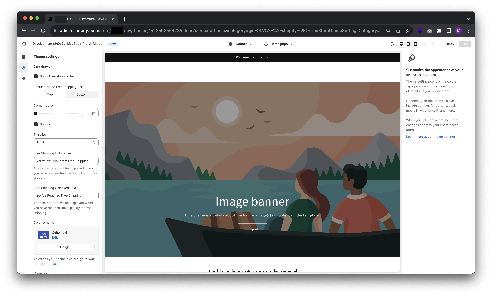

# Free Shipping Bar
## Prerequisites
| Platform	| Theme           | Skills|
| :-----------:|:--------------:| :------------:|
| Shopify      | Dawn 1.0  < up | ✨✨ |

## Adding the Required Code to the Theme:
To utilize this functionality, you'll need to make some changes to the code. The files to modify are:

- `settings_schema.json`: Responsible for creating the settings of this feature. To be modified.
- `cart-drawer.liquid`: Responsible for the visibility of the cart drawer. To be modified.
- `free-shipping-bar.liquid`: Entire code to be inserted into the theme. Copy and paste. Link to the file

### Modify settings_schema.json
You'll need to go to the section responsible for cart settings. Look for "name": "t:settings_schema.cart.name" and paste the following code:

``` 
{
  "type": "header",
  "content": "t:settings_schema.cart.settings.cart_drawer.header"
},
{
  "type": "checkbox",
  "id": "show_free_shipping_bar",
  "label": "Show Free shipping bar",
  "default": true
},
{
  "type": "text",
  "id": "free_shipping_treeshold",
  "label": "Free Shipping Treeshold",
  "info": "The text entered in this field should indicate the threshold for receiving free shipping.",
  "default": "500"
},
{
  "type": "select",
  "id": "free_shipping_bar_position",
  "options": [
    {
      "value": "top",
      "label": "t:sections.image-with-text.settings.desktop_content_position.options__1.label"
    },
    {
      "value": "bottom",
      "label": "t:sections.image-with-text.settings.desktop_content_position.options__3.label"
    }
  ],
  "default": "bottom",
  "label": "Position of the Free Shipping Bar"
},
{
  "type": "range",
  "id": "progress_bar_radius",
  "min": 0,
  "max": 40,
  "step": 2,
  "unit": "px",
  "label": "t:settings_schema.global.settings.corner_radius.label",
  "default": 0
},
{
  "type": "checkbox",
  "id": "show_icon",
  "label": "Show icon",
  "default": true
},
{
  "type": "select",
  "id": "icon",
  "options": [
    {
      "value": "none",
      "label": "t:sections.main-product.blocks.collapsible_tab.settings.icon.options__1.label"
    },
    {
      "value": "apple",
      "label": "t:sections.main-product.blocks.collapsible_tab.settings.icon.options__2.label"
    },
    {
      "value": "banana",
      "label": "t:sections.main-product.blocks.collapsible_tab.settings.icon.options__3.label"
    },
    {
      "value": "bottle",
      "label": "t:sections.main-product.blocks.collapsible_tab.settings.icon.options__4.label"
    },
    {
      "value": "box",
      "label": "t:sections.main-product.blocks.collapsible_tab.settings.icon.options__5.label"
    },
    {
      "value": "carrot",
      "label": "t:sections.main-product.blocks.collapsible_tab.settings.icon.options__6.label"
    },
    {
      "value": "chat_bubble",
      "label": "t:sections.main-product.blocks.collapsible_tab.settings.icon.options__7.label"
    },
    {
      "value": "check_mark",
      "label": "t:sections.main-product.blocks.collapsible_tab.settings.icon.options__8.label"
    },
    {
      "value": "clipboard",
      "label": "t:sections.main-product.blocks.collapsible_tab.settings.icon.options__9.label"
    },
    {
      "value": "dairy",
      "label": "t:sections.main-product.blocks.collapsible_tab.settings.icon.options__10.label"
    },
    {
      "value": "dairy_free",
      "label": "t:sections.main-product.blocks.collapsible_tab.settings.icon.options__11.label"
    },
    {
      "value": "dryer",
      "label": "t:sections.main-product.blocks.collapsible_tab.settings.icon.options__12.label"
    },
    {
      "value": "eye",
      "label": "t:sections.main-product.blocks.collapsible_tab.settings.icon.options__13.label"
    },
    {
      "value": "fire",
      "label": "t:sections.main-product.blocks.collapsible_tab.settings.icon.options__14.label"
    },
    {
      "value": "gluten_free",
      "label": "t:sections.main-product.blocks.collapsible_tab.settings.icon.options__15.label"
    },
    {
      "value": "heart",
      "label": "t:sections.main-product.blocks.collapsible_tab.settings.icon.options__16.label"
    },
    {
      "value": "iron",
      "label": "t:sections.main-product.blocks.collapsible_tab.settings.icon.options__17.label"
    },
    {
      "value": "leaf",
      "label": "t:sections.main-product.blocks.collapsible_tab.settings.icon.options__18.label"
    },
    {
      "value": "leather",
      "label": "t:sections.main-product.blocks.collapsible_tab.settings.icon.options__19.label"
    },
    {
      "value": "lightning_bolt",
      "label": "t:sections.main-product.blocks.collapsible_tab.settings.icon.options__20.label"
    },
    {
      "value": "lipstick",
      "label": "t:sections.main-product.blocks.collapsible_tab.settings.icon.options__21.label"
    },
    {
      "value": "lock",
      "label": "t:sections.main-product.blocks.collapsible_tab.settings.icon.options__22.label"
    },
    {
      "value": "map_pin",
      "label": "t:sections.main-product.blocks.collapsible_tab.settings.icon.options__23.label"
    },
    {
      "value": "nut_free",
      "label": "t:sections.main-product.blocks.collapsible_tab.settings.icon.options__24.label"
    },
    {
      "value": "pants",
      "label": "t:sections.main-product.blocks.collapsible_tab.settings.icon.options__25.label"
    },
    {
      "value": "paw_print",
      "label": "t:sections.main-product.blocks.collapsible_tab.settings.icon.options__26.label"
    },
    {
      "value": "pepper",
      "label": "t:sections.main-product.blocks.collapsible_tab.settings.icon.options__27.label"
    },
    {
      "value": "perfume",
      "label": "t:sections.main-product.blocks.collapsible_tab.settings.icon.options__28.label"
    },
    {
      "value": "plane",
      "label": "t:sections.main-product.blocks.collapsible_tab.settings.icon.options__29.label"
    },
    {
      "value": "plant",
      "label": "t:sections.main-product.blocks.collapsible_tab.settings.icon.options__30.label"
    },
    {
      "value": "price_tag",
      "label": "t:sections.main-product.blocks.collapsible_tab.settings.icon.options__31.label"
    },
    {
      "value": "question_mark",
      "label": "t:sections.main-product.blocks.collapsible_tab.settings.icon.options__32.label"
    },
    {
      "value": "recycle",
      "label": "t:sections.main-product.blocks.collapsible_tab.settings.icon.options__33.label"
    },
    {
      "value": "return",
      "label": "t:sections.main-product.blocks.collapsible_tab.settings.icon.options__34.label"
    },
    {
      "value": "ruler",
      "label": "t:sections.main-product.blocks.collapsible_tab.settings.icon.options__35.label"
    },
    {
      "value": "serving_dish",
      "label": "t:sections.main-product.blocks.collapsible_tab.settings.icon.options__36.label"
    },
    {
      "value": "shirt",
      "label": "t:sections.main-product.blocks.collapsible_tab.settings.icon.options__37.label"
    },
    {
      "value": "shoe",
      "label": "t:sections.main-product.blocks.collapsible_tab.settings.icon.options__38.label"
    },
    {
      "value": "silhouette",
      "label": "t:sections.main-product.blocks.collapsible_tab.settings.icon.options__39.label"
    },
    {
      "value": "snowflake",
      "label": "t:sections.main-product.blocks.collapsible_tab.settings.icon.options__40.label"
    },
    {
      "value": "star",
      "label": "t:sections.main-product.blocks.collapsible_tab.settings.icon.options__41.label"
    },
    {
      "value": "stopwatch",
      "label": "t:sections.main-product.blocks.collapsible_tab.settings.icon.options__42.label"
    },
    {
      "value": "truck",
      "label": "t:sections.main-product.blocks.collapsible_tab.settings.icon.options__43.label"
    },
    {
      "value": "washing",
      "label": "t:sections.main-product.blocks.collapsible_tab.settings.icon.options__44.label"
    }
  ],
  "default": "truck",
  "label": "t:sections.main-product.blocks.icon_with_text.settings.icon_3.label"
},
{
  "type": "text",
  "id": "free_shipping_message_threeshold",
  "label": "Free Shipping Unlock Text",
  "info": "The text entered will be displayed when you have not reached the eligibility for free shipping.",
  "default": "You're ## Away from Free Shipping!"
},
{
  "type": "text",
  "id": "free_shipping_message_unlocked",
  "label": "Free Shipping Unlocked Text",
  "info": "The text entered will be displayed when you have reached the eligibility for free shipping.",
  "default": "You've Reached Free Shipping!"
},
{
  "type": "color_scheme",
  "id": "color_scheme",
  "label": "t:sections.all.colors.label",
  "default": "background-1"
}
```
### Modify cart-drawer.liquid snippet
You will need to paste two different code snippets in two positions:
Before `<cart-drawer-items>`.
```

  

```
Inside the class `"cart-drawer__footer" `
```

  

```
### Create snippet free-shipping-bar.liquid
Create a new file in snippets and paste the content from the following file. <a href="https://github.com/mattiadragone/Helium-Theme/blob/master/snippets/free-shipping-bar.liquid" target="_blank">Link to the file</a>


-------

## Configuration of the Free Shipping Progress Bar in the Cart Drawer::


- **Step 1:** Access your Shopify admin panel.

- **Step 2:** In the left sidebar, go to "Online Store" and select Themes.

- **Step 3:** In the Themes section, find and click on Customize next to the theme you are using.

- **Step 4:** In the customization mode, look for the Theme Settings option and select it.

- **Step 5:** Inside the Theme Settings, find and click on Cart.

- **Step 6:** Now you will find the settings:

  - **Show Free Shipping Bar** Make sure this option is enabled to activate the progress bar.

  - **Free Shipping Treeshold** Enter the threshold value to qualify for free shipping.

  - **Position of the Free Shipping Bar** Choose whether you want to position the bar at the top, bottom, or customize the corner radius.

  - **Show icon** Choose the icon you want to use to represent progress toward free shipping. You can choose between "Truck", "Free Shipping" etc.

  - **Free Shipping Unlock Text** Configure the text that will be displayed when the customer has not yet reached the minimum amount for free shipping. For example, you can set it to "You're ## Away from Free Shipping!"

  - **Free Shipping Unlocked Text** Configure the text that will be displayed when the customer has reached the minimum amount for free shipping. For example, you can set it to "You've Reached Free Shipping!"

- **Step 7:** Choose a color scheme from the available options or customize the colors to match your theme.

- **Step 8:** Make sure to save the settings when you have completed the configuration.

Your customers will see how much they need to reach free shipping and will be encouraged to reach the goal. Additionally, you can use this feature creatively to show how close customers are to getting a free gift, further incentivizing purchases.

