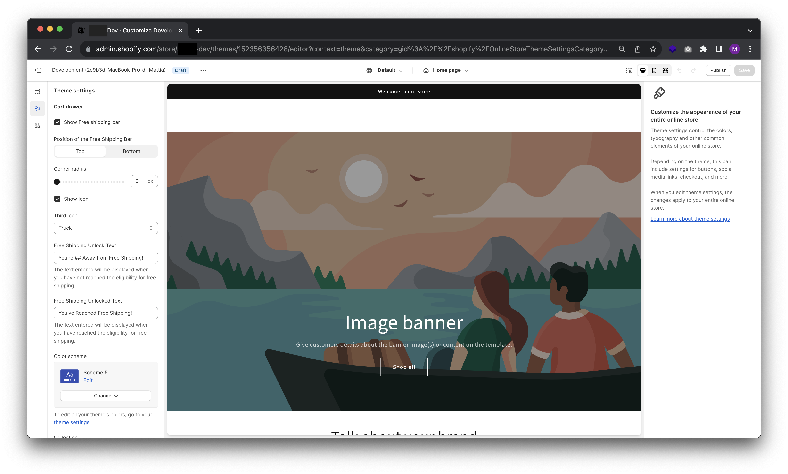

# Free Shipping Bar
## Pre requisiti
| Piattaforma| Tema           | Competenze|
| :-----------:|:--------------:| :------------:|
| Shopify      | Dawn 1.0  < up | ✨✨ |

## Inserimento nel tema  del codice necessario al funzionamento:
Per poter utilizzare la funzionalità bisognerà mettere un po' mano al codice. I file da modificare saranno:
- `settings_schema.json` responsabile della creazione delle impostazioni della funzionalità. Da modificare.
- `cart-drawer.liquid` responsabile della visibilità dello stesso. Da modificare.
- `free-shipping-bar.liquid` codice intero da inserire nel tema. Da copiare e incollare. <a href="https://github.com/mattiadragone/Helium-Theme/blob/master/snippets/free-shipping-bar.liquid" target="_blank">Link al file</a>

### Modifica settings_schema.json
Bisognerà andare nella riga responsabile delle impostazioni del cart basterà cercare `"name": "t:settings_schema.cart.name"` ed incollare tutto questo codice:

``` 
{
  "type": "header",
  "content": "t:settings_schema.cart.settings.cart_drawer.header"
},
{
  "type": "checkbox",
  "id": "show_free_shipping_bar",
  "label": "Show Free shipping bar",
  "default": true
},
{
  "type": "text",
  "id": "free_shipping_treeshold",
  "label": "Free Shipping Treeshold",
  "info": "The text entered in this field should indicate the threshold for receiving free shipping.",
  "default": "500"
},
{
  "type": "select",
  "id": "free_shipping_bar_position",
  "options": [
    {
      "value": "top",
      "label": "t:sections.image-with-text.settings.desktop_content_position.options__1.label"
    },
    {
      "value": "bottom",
      "label": "t:sections.image-with-text.settings.desktop_content_position.options__3.label"
    }
  ],
  "default": "bottom",
  "label": "Position of the Free Shipping Bar"
},
{
  "type": "range",
  "id": "progress_bar_radius",
  "min": 0,
  "max": 40,
  "step": 2,
  "unit": "px",
  "label": "t:settings_schema.global.settings.corner_radius.label",
  "default": 0
},
{
  "type": "checkbox",
  "id": "show_icon",
  "label": "Show icon",
  "default": true
},
{
  "type": "select",
  "id": "icon",
  "options": [
    {
      "value": "none",
      "label": "t:sections.main-product.blocks.collapsible_tab.settings.icon.options__1.label"
    },
    {
      "value": "apple",
      "label": "t:sections.main-product.blocks.collapsible_tab.settings.icon.options__2.label"
    },
    {
      "value": "banana",
      "label": "t:sections.main-product.blocks.collapsible_tab.settings.icon.options__3.label"
    },
    {
      "value": "bottle",
      "label": "t:sections.main-product.blocks.collapsible_tab.settings.icon.options__4.label"
    },
    {
      "value": "box",
      "label": "t:sections.main-product.blocks.collapsible_tab.settings.icon.options__5.label"
    },
    {
      "value": "carrot",
      "label": "t:sections.main-product.blocks.collapsible_tab.settings.icon.options__6.label"
    },
    {
      "value": "chat_bubble",
      "label": "t:sections.main-product.blocks.collapsible_tab.settings.icon.options__7.label"
    },
    {
      "value": "check_mark",
      "label": "t:sections.main-product.blocks.collapsible_tab.settings.icon.options__8.label"
    },
    {
      "value": "clipboard",
      "label": "t:sections.main-product.blocks.collapsible_tab.settings.icon.options__9.label"
    },
    {
      "value": "dairy",
      "label": "t:sections.main-product.blocks.collapsible_tab.settings.icon.options__10.label"
    },
    {
      "value": "dairy_free",
      "label": "t:sections.main-product.blocks.collapsible_tab.settings.icon.options__11.label"
    },
    {
      "value": "dryer",
      "label": "t:sections.main-product.blocks.collapsible_tab.settings.icon.options__12.label"
    },
    {
      "value": "eye",
      "label": "t:sections.main-product.blocks.collapsible_tab.settings.icon.options__13.label"
    },
    {
      "value": "fire",
      "label": "t:sections.main-product.blocks.collapsible_tab.settings.icon.options__14.label"
    },
    {
      "value": "gluten_free",
      "label": "t:sections.main-product.blocks.collapsible_tab.settings.icon.options__15.label"
    },
    {
      "value": "heart",
      "label": "t:sections.main-product.blocks.collapsible_tab.settings.icon.options__16.label"
    },
    {
      "value": "iron",
      "label": "t:sections.main-product.blocks.collapsible_tab.settings.icon.options__17.label"
    },
    {
      "value": "leaf",
      "label": "t:sections.main-product.blocks.collapsible_tab.settings.icon.options__18.label"
    },
    {
      "value": "leather",
      "label": "t:sections.main-product.blocks.collapsible_tab.settings.icon.options__19.label"
    },
    {
      "value": "lightning_bolt",
      "label": "t:sections.main-product.blocks.collapsible_tab.settings.icon.options__20.label"
    },
    {
      "value": "lipstick",
      "label": "t:sections.main-product.blocks.collapsible_tab.settings.icon.options__21.label"
    },
    {
      "value": "lock",
      "label": "t:sections.main-product.blocks.collapsible_tab.settings.icon.options__22.label"
    },
    {
      "value": "map_pin",
      "label": "t:sections.main-product.blocks.collapsible_tab.settings.icon.options__23.label"
    },
    {
      "value": "nut_free",
      "label": "t:sections.main-product.blocks.collapsible_tab.settings.icon.options__24.label"
    },
    {
      "value": "pants",
      "label": "t:sections.main-product.blocks.collapsible_tab.settings.icon.options__25.label"
    },
    {
      "value": "paw_print",
      "label": "t:sections.main-product.blocks.collapsible_tab.settings.icon.options__26.label"
    },
    {
      "value": "pepper",
      "label": "t:sections.main-product.blocks.collapsible_tab.settings.icon.options__27.label"
    },
    {
      "value": "perfume",
      "label": "t:sections.main-product.blocks.collapsible_tab.settings.icon.options__28.label"
    },
    {
      "value": "plane",
      "label": "t:sections.main-product.blocks.collapsible_tab.settings.icon.options__29.label"
    },
    {
      "value": "plant",
      "label": "t:sections.main-product.blocks.collapsible_tab.settings.icon.options__30.label"
    },
    {
      "value": "price_tag",
      "label": "t:sections.main-product.blocks.collapsible_tab.settings.icon.options__31.label"
    },
    {
      "value": "question_mark",
      "label": "t:sections.main-product.blocks.collapsible_tab.settings.icon.options__32.label"
    },
    {
      "value": "recycle",
      "label": "t:sections.main-product.blocks.collapsible_tab.settings.icon.options__33.label"
    },
    {
      "value": "return",
      "label": "t:sections.main-product.blocks.collapsible_tab.settings.icon.options__34.label"
    },
    {
      "value": "ruler",
      "label": "t:sections.main-product.blocks.collapsible_tab.settings.icon.options__35.label"
    },
    {
      "value": "serving_dish",
      "label": "t:sections.main-product.blocks.collapsible_tab.settings.icon.options__36.label"
    },
    {
      "value": "shirt",
      "label": "t:sections.main-product.blocks.collapsible_tab.settings.icon.options__37.label"
    },
    {
      "value": "shoe",
      "label": "t:sections.main-product.blocks.collapsible_tab.settings.icon.options__38.label"
    },
    {
      "value": "silhouette",
      "label": "t:sections.main-product.blocks.collapsible_tab.settings.icon.options__39.label"
    },
    {
      "value": "snowflake",
      "label": "t:sections.main-product.blocks.collapsible_tab.settings.icon.options__40.label"
    },
    {
      "value": "star",
      "label": "t:sections.main-product.blocks.collapsible_tab.settings.icon.options__41.label"
    },
    {
      "value": "stopwatch",
      "label": "t:sections.main-product.blocks.collapsible_tab.settings.icon.options__42.label"
    },
    {
      "value": "truck",
      "label": "t:sections.main-product.blocks.collapsible_tab.settings.icon.options__43.label"
    },
    {
      "value": "washing",
      "label": "t:sections.main-product.blocks.collapsible_tab.settings.icon.options__44.label"
    }
  ],
  "default": "truck",
  "label": "t:sections.main-product.blocks.icon_with_text.settings.icon_3.label"
},
{
  "type": "text",
  "id": "free_shipping_message_threeshold",
  "label": "Free Shipping Unlock Text",
  "info": "The text entered will be displayed when you have not reached the eligibility for free shipping.",
  "default": "You're ## Away from Free Shipping!"
},
{
  "type": "text",
  "id": "free_shipping_message_unlocked",
  "label": "Free Shipping Unlocked Text",
  "info": "The text entered will be displayed when you have reached the eligibility for free shipping.",
  "default": "You've Reached Free Shipping!"
},
{
  "type": "color_scheme",
  "id": "color_scheme",
  "label": "t:sections.all.colors.label",
  "default": "background-1"
}
```
### Modifica snippet cart-drawer.liquid
Bisognerà incollare due snippet di codice differente in due posizioni:
Prima di `<cart-drawer-items>`
```

  

```
Dentro la classe `"cart-drawer__footer" `
```

  

```
### Inserimento snippet free-shipping-bar.liquid
Creare un nuovo file in snippets e incollare il contenuto del seguente file. <a href="https://github.com/mattiadragone/Helium-Theme/blob/master/snippets/free-shipping-bar.liquid" target="_blank">Link al file</a>


-------

## Configurazione della Barra di Progresso per la Spedizione Gratuita nel Cart Drawer:


- **Passo 1:** Accedi al tuo pannello di amministrazione di Shopify.

- **Passo 2:** Nella barra laterale di sinistra, vai su "Online Store" e seleziona Temi.

- **Passo 3:** Nella sezione Temi, trova e fai clic su Personalizza accanto al tema che stai utilizzando.

- **Passo 4:** Nella modalità di personalizzazione, cerca l'opzione Impostazioni tema e selezionala.

- **Passo 5:** All'interno delle Impostazioni tema, cerca e fai clic su Carrello.

- **Passo 6:** Ora troverai le impostazioni:

  - **Show Free Shipping Bar** (Mostra la barra della spedizione gratuita): Assicurati che questa opzione sia attivata per abilitare la barra di progresso.

  - **Free Shipping Treeshold** (Soglia spedizione gratuita): inserisci il valore soglia per ottenere la spedizione gratuita.

  - **Position of the Free Shipping Bar** (Posizione della barra di spedizione gratuita): Scegli se desideri posizionare la barra in alto (Top), in basso (Bottom), o personalizzare l'angolo (Corner radius).

  - **Show icon** (Mostra l'icona): Scegli l'icona che desideri utilizzare per rappresentare il progresso verso la spedizione gratuita. Puoi scegliere tra "Truck" o "Free Shipping" (Camion o Spedizione gratuita).

  - **Free Shipping Unlock Text** (Testo per lo sblocco della spedizione gratuita): Configura il testo che verrà visualizzato quando il cliente non ha ancora raggiunto l'importo minimo per la spedizione gratuita. Ad esempio, puoi impostare "Ti mancano ## per la spedizione gratuita!".

  - **Free Shipping Unlocked Text** (Testo per lo sblocco della spedizione gratuita): Configura il testo che verrà visualizzato quando il cliente ha raggiunto l'importo minimo per la spedizione gratuita. Ad esempio, puoi impostare "Hai ottenuto la spedizione gratuita!".

- **Passo 7:** Scegli uno schema di colori tra le opzioni disponibili o personalizza i colori per adattarli al tuo tema.

- **Passo 8:** Assicurati di salvare le impostazioni quando hai completato la configurazione.

I tuoi clienti vedranno quanto manca per ottenere la spedizione gratuita e saranno incoraggiati a raggiungere l'obiettivo. 
Inoltre, puoi utilizzare questa funzionalità in modo creativo per mostrare quanto manca per ottenere un regalo gratuito, incentivando ulteriormente gli acquisti.

