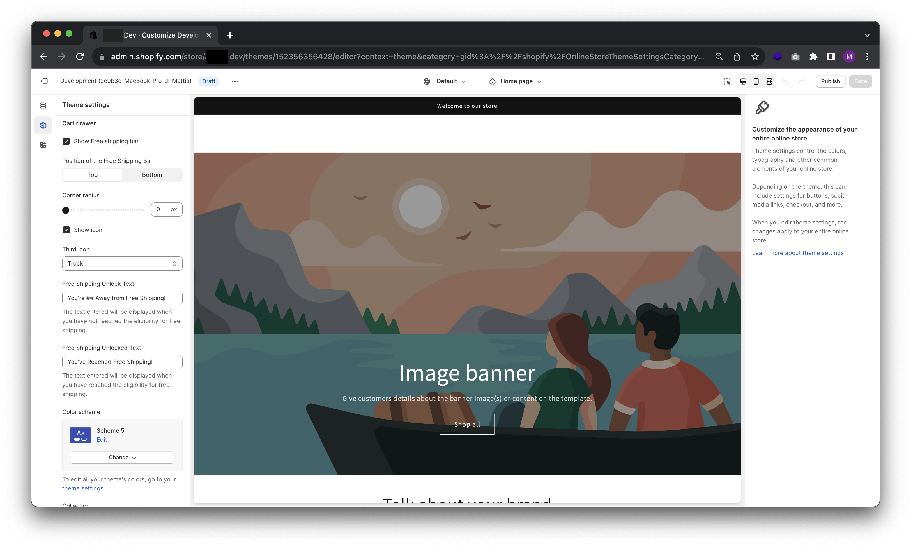

# Free Shipping bar

## Introduction to the functionality and what it does

The free shipping bar is a component that can be added to your Shopify store to inform customers how much they need to spend to qualify for free shipping. This can help you increase sales and encourage customers to spend more.



## Customization options

The free shipping bar can be customized in a number of ways:

- **Position:** The bar can be placed at the top or bottom of the page.
- **Icon:** You can choose to show or not show an icon in the bar.
- **Message:** You can modify the message that is displayed in the bar.
- Colors:** You can modify the colors of the bar to match the design of your store.
Comments

The code you provided is well-written and easy to understand. Here are a few suggestions for further improving the code:

- You can add a comment at the beginning of the code to explain what the free shipping bar does.
- You can use more descriptive variable names. For example, instead of using ```free_shipping_bar_position```, you could use ```free_shipping_bar_location ```.
- You can use comments to explain what each section of code does.
Conclusion

The free shipping bar is a great way to encourage customers to spend more in your Shopify store. The code you provided is well-written and easy to understand. I provided a few suggestions for further improving the code, but these are not necessary if you do not want to make them.

I want to upgrade the functionality and I am open to suggestions

I am glad to hear that you are interested in improving the functionality of the free shipping bar. Here are a few suggestions:

- **Add a progress bar:** You can add a progress bar to the bar to show customers how far they are from qualifying for free shipping. This can motivate customers to spend more.

- **Add an incentive message:** You can add an incentive message to the bar to inform customers of the benefits they can receive by spending more. For example, you could offer a discount or a free gift to customers who spend over a certain threshold.
I hope these suggestions are helpful. Good luck with your Shopify store!
